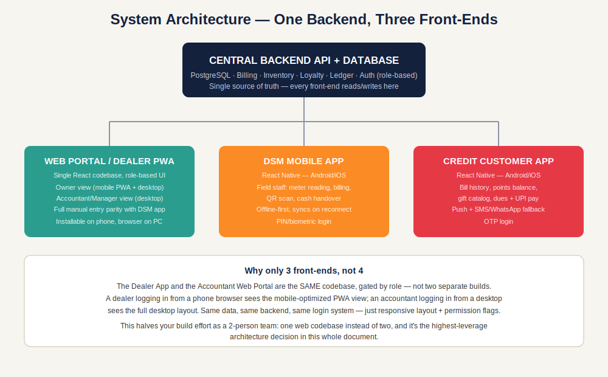
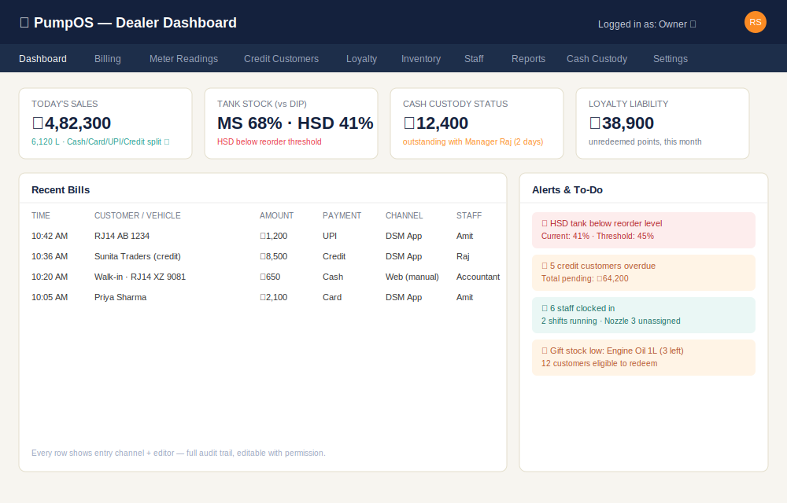
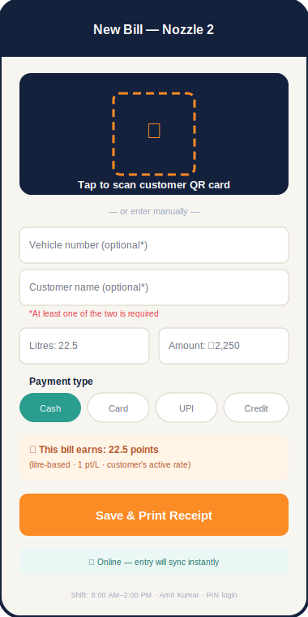
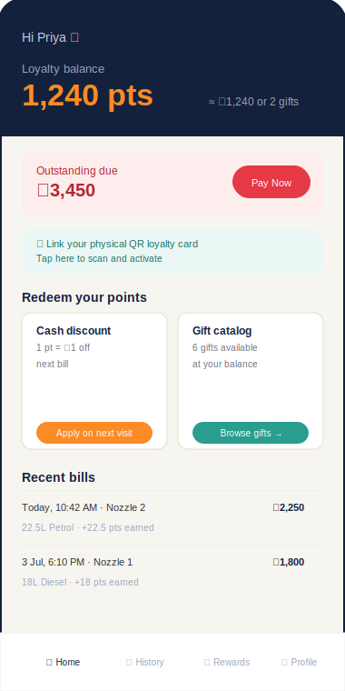
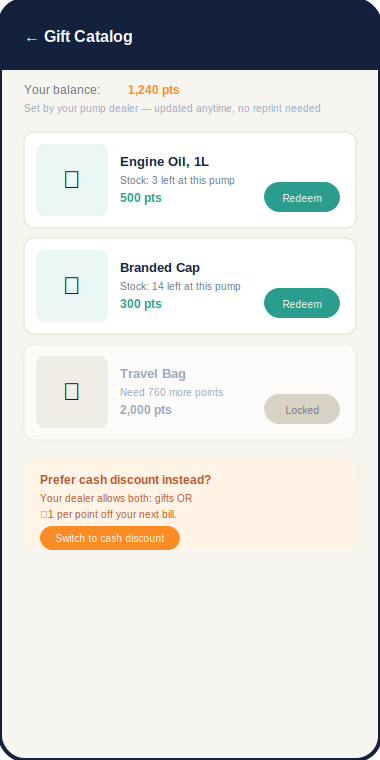
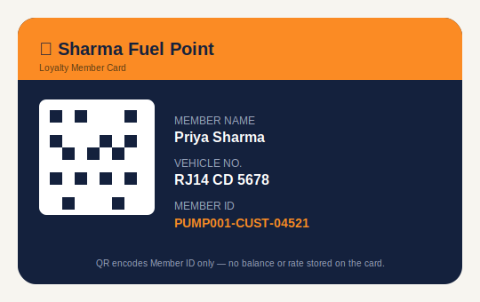

# Petrol Pump Management Software — Master Plan v2.0
**Your single source of truth. If you're confused about any feature, a flow, a screen, or what to build next — come back here first, before asking Claude Code anything.**

*How to use this document with Claude Code: paste the relevant section (not the whole doc) into your prompt when asking Claude Code to build a feature. Each feature entry below is written so it can be handed to Claude Code almost as-is as a spec.*

---

## Table of Contents

1. [System Overview & Architecture](#1-system-overview--architecture)
2. [User Roles & Access Matrix](#2-user-roles--access-matrix)
3. [Feature List — Web Portal / Dealer PWA](#3-feature-list--web-portal--dealer-pwa)
4. [Feature List — DSM Mobile App](#4-feature-list--dsm-mobile-app)
5. [Feature List — Credit Customer App](#5-feature-list--credit-customer-app)
5A. [Partial / Split Payments](#5a-partial--split-payments)
6. [Loyalty Program — Full Design](#6-loyalty-program--full-design)
7. [Inventory Management Module](#7-inventory-management-module)
8. [Day-End Cash Reconciliation & Custody](#8-day-end-cash-reconciliation--custody)
8A. [Walk-in Sales Capture & Automated Payment Reconciliation](#8a-walk-in-sales-capture--automated-payment-reconciliation)
9. [OCR for Supplier Purchase Entries](#9-ocr-for-supplier-purchase-entries)
10. [Tally Integration](#10-tally-integration)
11. [Notifications (Push / SMS / WhatsApp)](#11-notifications-push--sms--whatsapp)
12. [Reports & Analytics — Full List](#12-reports--analytics--full-list)
13. [Database Schema](#13-database-schema)
14. [UI/UX Mockups](#14-uiux-mockups)
15. [Tech Stack](#15-tech-stack)
16. [End-to-End Implementation Plan](#16-end-to-end-implementation-plan)
17. [Open Decisions / Risks to Track](#17-open-decisions--risks-to-track)
18. [A–Z Quick Reference Index](#18-az-quick-reference-index)

---

## 1. System Overview & Architecture

**One backend, three front-ends** (not four — see the design decision below). Every entity — customers, bills, inventory, loyalty points, staff, cash — lives in one central PostgreSQL database behind one API. Three interfaces read/write to it.



### 1.1 The three front-ends

| Front-end | Who uses it | Built as | Primary device |
|---|---|---|---|
| **Web Portal / Dealer PWA** | Owner/dealer (mobile, on the go) **and** Accountant/Manager (desktop, full-time data entry) | One responsive React codebase, installable as a PWA | Phone (dealer) + Desktop browser (accountant) |
| **DSM Mobile App** | Field staff at the nozzle | React Native (Android/iOS) | Phone, offline-first |
| **Credit Customer App** | Loyalty/credit customers | React Native (Android/iOS) | Phone |

### 1.2 Why one Web Portal instead of a separate "Dealer App"

You asked for a dealer app **and** a web portal for the accountant. Building these as two separate codebases would roughly double your frontend work for a 2-person team — and there's no real need to, because the difference between "what the dealer sees" and "what the accountant sees" is a **permissions and layout** problem, not a different product. The solution:

- It's **one React app**, built responsive-first and PWA-installable.
- A dealer installs it on their phone home screen like an app (works offline for viewing cached data, syncs live when online).
- An accountant opens the exact same app in a desktop browser and sees a fuller desktop layout — more columns, more on-screen at once, keyboard-friendly manual entry.
- What each of them can *do* (edit vs. view, which modules are visible, whether they can change loyalty rates or only enter bills) is controlled entirely by their **role** (Section 2), not by which "app" they're using.
- This means: build the feature once, and both the dealer's mobile view and the accountant's desktop view automatically get it. One codebase, one bug list, one deployment.

### 1.3 Why this matters operationally

A meter reading entered on the DSM's phone shows up instantly on the owner's phone and the accountant's desktop. A manual correction the accountant makes is instantly reflected everywhere else. You build the core logic (billing, points, inventory, cash) exactly once, in the backend — every front-end is just a different view into the same truth.


---

## 2. User Roles & Access Matrix

This is the answer to "the web portal is for the accountant or anyone doing manual entry" — that's not one role, it's several, and each needs different permissions. Define these five roles in the backend from day one, even if you only use two of them at launch.

| Role | Typical person | Can do | Cannot do |
|---|---|---|---|
| **Owner/Dealer** | You | Everything: settings, loyalty rate/gift config, staff management, all reports, all edits, financial data | Nothing restricted |
| **Accountant** | Your accountant or bookkeeper | Full manual bill/meter entry, credit ledger, cash reconciliation entry, view all reports, export to Tally | Cannot change loyalty rates, cannot edit staff PINs, cannot change business settings |
| **Manager** | A trusted on-site manager | Day-to-day ops: bills, meter readings, staff attendance, cash handover entry | Cannot view full P&L, cannot change settings or loyalty config |
| **DSM/Cashier** | Field staff | DSM app only: their own shift's bills, meter readings, cash handover | No web portal access at all |
| **Read-only** | Investor, family member, auditor | View dashboards and reports only | Cannot edit or enter anything |

**How this is implemented:** a `role` field on the `Staff`/`User` table, checked by the backend API on every request (never trust the frontend to hide a button — always enforce on the server too). Each role maps to a permission set stored as a config table, so you can adjust who-can-do-what later without redeploying code.

**Practical note on "anyone who wants to do manual entry":** give that person the **Accountant** role. It has everything needed for full manual parity with the DSM app (Section 2.2 style entry, corrections, ledger work) but is deliberately blocked from touching loyalty economics or business settings — so your accountant can do their job without being able to accidentally reconfigure your gift catalog or discount rates.

---

## 3. Feature List — Web Portal / Dealer PWA

Every feature below includes **what it does, why it exists, and how it works** — so if you forget what a feature is for six months from now, this section alone should answer it.

### 3.1 Dashboard (home screen)

**What it does:** the first screen after login — a single glance at the pump's health right now.

**Contains:**
- Today's sales: total litres, ₹ amount, split by Cash / Card / UPI / Credit
- Nozzle-wise sales snapshot
- Tank stock levels (live system-calculated, vs. last physical DIP)
- Pending credit dues (top 5 overdue customers)
- Staff currently clocked in
- Low stock alerts (fuel + lubricants + **gift catalog items**, see Section 6)
- Cash custody status (reconciled / pending — Section 8)
- Loyalty points liability (unredeemed points × redemption value — this is real money you owe, track it here)

**Why it exists:** this is the "should I worry about anything today" screen. Everything on it is either a number that changes daily or an alert that needs action.

**How it works:** every widget is a live query against the backend, refreshed on load and on a background poll (e.g. every 60 seconds) so numbers don't go stale if the dashboard is left open.

### 3.2 Sales & Billing

**What it does:** the full bill register — view, search, and manually manage every bill ever entered, from any channel.

| Sub-feature | Detail |
|---|---|
| View all bills | Filters: date range, customer, DSM, payment type, vehicle number |
| Manually add/edit/delete a bill | Full parity with what the DSM app can do — this was your explicit original requirement, and it's how an accountant fixes a mistake without needing the DSM's phone |
| Bill detail view | Shows entry channel (web/DSM app), timestamp, which staff member entered/edited it — this is your audit trail, don't skip it |

**Why full edit parity matters:** DSMs make typos, phones die mid-shift, and sometimes a bill needs to be corrected days later when a customer disputes an amount. Without web-side edit access, every correction becomes a support ticket to whoever manages the DSM app — full parity removes that bottleneck.

### 3.3 Meter Reading Management

**What it does:** tracks opening/closing meter readings per nozzle per shift, and catches discrepancies.

- View readings by shift/DSM/nozzle
- Manual entry option — fallback if the DSM app fails, or for corrections
- Auto-calculated litres sold = closing reading − opening reading
- **Variance flag**: fires when litres sold (from meter) ≠ litres billed (from bills) — this catches DSM entry mistakes or pilferage before it becomes a pattern

**Why it exists:** the meter is the ground truth for how much fuel physically left the tank. Bills are what customers were charged. If these two numbers don't match over time, either someone is under-billing (theft or error) or the meter itself has drifted — both need immediate attention, which is why this is a flag, not just a report you'd have to go looking for.

### 3.4 Credit Customer Management

**What it does:** the accounts-receivable module for customers who buy on credit rather than paying per visit.

- Customer master: name, phone, vehicle number(s), credit limit, outstanding balance
- Full ledger per customer: every bill, every payment, running balance
- Set/edit credit limit — bills should be blocked (or flagged) if a customer is over their limit
- Record payment received (cash/UPI/bank transfer against dues)
- Bulk statement export (for month-end billing to credit customers, e.g. a transport company)

**Why it exists:** credit customers are typically your highest-value, highest-risk relationships — a fleet operator running a monthly tab. Losing track of who owes what, and by how much, is the single most common way small pumps bleed money silently.

### 3.5 Loyalty Program Control

Full detail in **Section 6**. Summary of what lives here:
- View all customers' points balance
- Set default earning rate, and whether it's litre-based or rupee-based
- Override rate per individual customer or customer group
- Set redemption rules: cash-discount ratio, minimum redeemable points, and/or gift catalog
- Maintain the gift catalog (add/edit/remove gifts, set points cost, track gift stock)
- Generate/print/reprint QR loyalty cards
- Points transaction log (earned/redeemed/expired) — full audit trail

### 3.6 Inventory Management

Full detail in **Section 7**. Summary:
- Tank-wise stock: fuel type, current level, capacity, reorder threshold
- Lubricant stock: item-wise quantity, reorder threshold
- Purchase entry: manual + OCR-assisted (Section 9)
- Stock variance report: purchased − sold − physical DIP = variance
- Supplier ledger: amount owed to IOCL/BPCL/HPCL/distributors
- **Rate Master**: date-wise fuel price history (see 7.4 — this was missing from v1 and is genuinely important)
- **Density/quality log**: PPM or density reading per DIP/tanker delivery, for OMC compliance

### 3.7 Staff Management

- Staff master: name, phone, PIN/login credential, role (Section 2)
- Attendance log: clock-in/out derived from first/last app activity per shift
- Shift assignment
- Salary/advance tracking (optional, Phase 5+)

### 3.8 Reports & Analytics

Full list in **Section 12**.

### 3.9 Settings

- Business profile, GSTIN, pump license details
- User roles & permissions (Section 2)
- Notification settings (push / SMS / WhatsApp toggles — Section 11)
- Backup/export data
- **Tally export configuration** (Section 10)

---

## 4. Feature List — DSM Mobile App

**Who this is for:** the field staff standing at the nozzle, billing customers in real time.

| Feature | What it does | Why / how |
|---|---|---|
| PIN or biometric login | Staff logs in with a PIN or fingerprint, not free-text name entry | Ties attendance and every bill to a verifiable credential — you always know exactly who entered what |
| Shift start: opening meter reading | DSM enters opening reading per nozzle at shift start | Baseline for the shift's litres-sold calculation |
| Shift end: closing meter reading | DSM enters closing reading; app auto-calculates litres sold | closing − opening = litres sold, feeds the Variance Flag (3.3) |
| New Bill screen | QR scan → auto-fills customer name, vehicle, loyalty rate → DSM enters amount/litres → saves | This is the core transaction screen — see the full flow in Section 6.3 |
| Payment type selection | Cash / Card / UPI / Credit | Every bill must be tagged so cash reconciliation (Section 8) and reports (Section 12) can split correctly |
| Shift-end cash handover entry | Mirrors the web app's Day-End entry (Section 8): deposited / locker / taken home | Captures cash custody at the point of handover, not hours later from memory |
| Bluetooth receipt printing | Prints a physical receipt via ESC/POS thermal printer over Bluetooth | Customers expect a paper receipt; this is standard at every Indian fuel station |
| View own shift summary | Litres sold, cash collected, bills entered — for that DSM's current shift only | Lets staff self-check before handover, reduces end-of-shift disputes |
| Offline mode | If there's no signal, entries queue locally and sync automatically once reconnected | Rural pump connectivity is unreliable — an app that can't work offline is a non-starter here |

**Bill entry validation rule** (applies here and on the web portal): Vehicle Number and Customer Name are each individually optional, but **at least one of the two must be filled** before the Save button is enabled. If the customer scanned a QR card, both fields auto-populate and this is already satisfied. If it's a one-time walk-in cash sale, the DSM must type at least a vehicle number or a name. This keeps every bill traceable to *something*, even for non-loyalty customers.

---

## 5. Feature List — Credit Customer App

**Who this is for:** your loyalty and credit customers — the people who visit repeatedly and either run a credit tab or earn points.

| Feature | What it does | Why / how |
|---|---|---|
| Login via phone number + OTP | No password to remember, no heavy signup | Matches how most Indian consumer apps handle low-friction onboarding |
| Bill history | Itemized view of every past bill: date, litres, amount, points earned | Builds trust — the customer can verify every transaction was logged correctly |
| Loyalty points balance + redemption | Shows current balance, and lets the customer choose cash-discount or gift redemption | Full detail in Section 6 |
| Gift catalog | Browse gifts the dealer has configured, see which are affordable now vs. locked | Section 6.4 |
| Outstanding dues + payment reminder | Shows what's owed, with a direct "Pay Now" action | Reduces the awkward in-person "you still owe us" conversation |
| Push notifications | Sent on every transaction: bill amount, points earned | Immediate confirmation builds trust and drives re-engagement |
| SMS / WhatsApp fallback | If push fails or the app isn't installed, the same notification goes by SMS/WhatsApp | Section 11 — not every customer will install the app, and that's fine, they should still get notified |
| Simple online payment (UPI deep link) | One tap opens the customer's UPI app pre-filled with the amount owed, to clear dues | Removes friction from debt collection — most people pay faster when it's one tap away |


---

## 5A. Partial / Split Payments

**What it does:** lets a single bill be settled across more than one payment method — e.g. half cash + half UPI, or "customer pays ₹1,000 via UPI on a ₹960 bill and gets ₹40 cash back." This replaces the old assumption of one `payment_type` per bill with a proper multi-line payment model.

**Why it exists:** in real pump operations, customers routinely split payment (not enough cash on them, want to round off a UPI transfer, etc.), and the "pay extra by UPI, take change in cash" pattern is extremely common at Indian fuel counters. A system that only allows one payment type per bill can't represent either case, and DSMs would just have to fudge it — which breaks your cash reconciliation (Section 8) the moment it happens.

### 5A.1 Data model

Each Bill can have **multiple `BillPaymentLine` rows** instead of a single payment_type field:

| Field | Purpose |
|---|---|
| `bill_id` | Which bill this line belongs to |
| `payment_type` | cash / card / upi / credit |
| `amount` | The value of this line |
| `direction` | `IN` (money received) or `OUT` (cash given back as change) |

**Validation rule:** `sum(amount where direction = IN) − sum(amount where direction = OUT) = bill.total_amount`. The Save button stays disabled until this balances — same pattern as the Day-End cash validation in Section 8.

### 5A.2 The two real scenarios this covers

**Scenario 1 — straightforward split:** Bill = ₹1,000. Customer pays ₹500 cash + ₹500 UPI.
→ Two `IN` lines: `{cash, 500}`, `{upi, 500}`. Sum = 1,000. Balances, bill saves.

**Scenario 2 — overpay by UPI, cash change returned:** Bill = ₹960. Customer pays ₹1,000 via UPI (rounding for convenience), DSM hands back ₹40 cash.
→ One `IN` line: `{upi, 1000}`, one `OUT` line: `{cash, 40}`. Net = 1,000 − 40 = 960. Balances, bill saves.
→ **This ₹40 must reduce that shift's "total cash collected" figure**, not add to it — a cash `OUT` line is money leaving the till, exactly like a customer refund. Section 8's Day-End Cash entry should net all `OUT` lines against `IN` lines automatically, so the dealer/accountant never has to manually subtract change given from the day's cash total.

### 5A.3 DSM app UX

- DSM taps "Add Payment," picks a method, enters the amount, and a running **"Remaining to collect"** ticker updates live.
- If the DSM enters an amount larger than what's remaining on a non-cash method, the app prompts: *"₹40 extra — give as cash change?"* and auto-creates the offsetting `OUT` line if confirmed.
- Save is only enabled once "Remaining" hits ₹0.
- Credit can be one of the split lines too — e.g. a regular walk-in pays ₹500 cash and puts the rest on their running credit tab, common for known local customers who aren't full "credit account" customers yet.

---

## 6. Loyalty Program — Full Design

This is the module you specifically asked to be flexible: litre-wise **or** rupee-wise earning, freedom to offer gifts or discounts, and a dealer-fed gift list customers can browse. Here is the complete design.

### 6.1 Core principle: the QR code identifies the customer — it never stores points or rate

The QR code is a **pointer** (like a name tag), not a wallet. All logic — how many points, what rate, what redemption options — lives in the database and can change anytime without reprinting a single card.

- **Encoded in the QR:** a unique customer ID, e.g. `PUMP001-CUST-04521` (plus an optional checksum for manual fallback entry).
- **Not encoded:** points balance, rate, or personal data. A QR scanned outside your system resolves to nothing.

### 6.2 Earning side — dealer chooses the basis

You get **one dealer-level setting** (`LoyaltyConfig.earning_basis`) that can be `rupee` or `litre`, plus the usual per-customer override:

| Basis | How points are calculated | When a dealer would pick this |
|---|---|---|
| **Rupee-based** | `points = (bill_amount / 100) × rate` | Simple, matches most competitor software, easy for customers to understand as "cashback-like" |
| **Litre-based** | `points = litres_purchased × rate` | Decouples rewards from daily fuel price swings — a customer filling the same 20L tank earns the same points whether the price went up or down that week; dealers who dislike variable-cost loyalty programs prefer this |

**Rate precedence when calculating points on a bill** (same logic either basis):
1. Does this customer have a specific override rate set? → use it.
2. Otherwise → use the dealer's default rate.

The DSM never sees or picks a rate — the system looks it up silently the moment the QR is scanned.

### 6.3 End-to-end transaction flow

```
1. Customer arrives → DSM opens "New Bill" in DSM app
2. DSM scans customer's QR card (or types phone number if card forgotten)
3. App fetches: customer name, vehicle no., earning basis + rate, outstanding balance
4. DSM enters: amount / litres, vehicle number, customer name
   → VALIDATION: at least one of [vehicle number, customer name] must be filled
5. DSM confirms → bill saved →
   - Credit ledger updated (if credit customer)
   - Points calculated using the customer's active basis + rate
   - Points added to customer's balance
   - Push notification sent: "Bill of ₹X added, Y points earned"
   - Receipt printed via Bluetooth printer
6. Web portal reflects the new bill instantly
```

### 6.4 Redemption side — entirely the dealer's call

This is the part you specifically asked to expand, and the design principle is simple: **the dealer decides how redemption works, end to end — not just which options exist, but whether the customer gets a say at all.** Two settings on `LoyaltyConfig` control this together:

| Setting | Values | What it controls |
|---|---|---|
| `redemption_type_allowed` | `cash`, `gift`, or `both` | Which redemption levers exist at this pump at all |
| `customer_can_choose_redemption` | `true` / `false` | If `both` is allowed above: **true** lets the customer pick cash-discount or a gift each time they redeem; **false** means the dealer has pre-set a fixed default (e.g. "always gift, unless staff manually overrides at the counter") and the customer simply sees what they're getting |

This gives you three real operating modes, not just one:
1. **Fully dealer-controlled:** `redemption_type_allowed = gift`, no customer choice — every redemption is a gift, full stop, because that's what the dealer decided the loyalty economics should look like.
2. **Fully customer-controlled:** `both` + `customer_can_choose_redemption = true` — customer picks per visit.
3. **Dealer-set default, staff can override at counter:** `both` + `customer_can_choose_redemption = false`, with a manual override option visible only in the DSM/web portal (not the customer app) for a staff member to switch a specific redemption when a customer asks nicely. Whether to expose that override is itself a dealer setting — up to you.

**Lever 1 — Cash discount**
Standard redemption: `X points = ₹Y off`. Dealer sets the ratio and a minimum redeemable threshold (e.g. "must have at least 100 points to redeem"). Applied as a line-item discount on the next bill.

**Lever 2 — Gift catalog**
Dealer maintains a list of physical gifts customers can redeem points for, instead of (or alongside) cash discount:

| Field | Purpose |
|---|---|
| `gift_name` | e.g. "Engine Oil 1L", "Branded Cap", "Travel Mug" |
| `image` | Shown in the customer app |
| `points_required` | Cost to redeem |
| `stock_quantity` | Optional — if tracked, the gift auto-hides or shows "out of stock" when depleted |
| `active_flag` | Dealer can retire a gift without deleting its redemption history |

The customer app shows the full catalog, with gifts the customer can't yet afford visually greyed out/"locked" (see mockup in Section 14) — this is a deliberate nudge toward repeat visits, and it's good for you too, not just the customer.

**Lever 3 — Both, dealer's choice per visit**
If `redemption_type_allowed = both`, the customer picks at redemption time whether to take a cash discount or a gift, for that specific redemption. Nothing stops a dealer from running gifts most of the year and switching to a cash-discount-only promo during a price war with a nearby pump — it's a config change, not a rebuild.

### 6.5 What's a software problem vs. an operations problem here

Being direct about this because it matters for planning: everything above (earning basis, redemption logic, gift catalog CRUD) is **a software problem** — straightforward CRUD and a couple of config flags, not architecturally hard.

What is **not** a software problem: physically stocking, storing, and handing out gift items at the pump counter. That's a real operational cost and a logistics decision for you as a business owner, independent of how good the software is. The one thing the software *can* do to help is optionally treat `GiftCatalogItem` as a special case of the `LubricantItem` inventory table (Section 7), so gift stock depletes automatically on redemption and shows up in the same low-stock alerts as motor oil. Worth doing once you have more than a handful of gift SKUs — not needed for MVP.

### 6.6 Redemption flow (customer's perspective)

- Customer app shows points balance and what it's worth (cash value, and/or catalog access)
- At next visit, DSM scans QR → app shows available points and redemption options → customer chooses → discount or gift is applied/recorded → points deducted
- Dealer sets minimum redeemable points and redemption ratio in Section 3.5 settings

### 6.7 QR card physical implementation

- Generated server-side when a new customer is added — free, any QR library
- Printed on laminated PVC card, sticker, or paper — PVC recommended for durability (dust, fuel spills)
- Cost: printing only, a few rupees per card, no reader hardware needed since the DSM's own phone camera scans it


---

## 7. Inventory Management Module

Ties fuel/lubricant purchases to what's sold, so you always know real stock — and, with the additions below, stay compliant with OMC (IOCL/BPCL/HPCL) audit expectations.

### 7.1 Core entities

| Entity | Fields |
|---|---|
| Tank | tank_id, fuel_type, capacity, current_level, calibration_chart_ref |
| Purchase Entry | date, supplier, product, quantity, rate, invoice_no, tanker_no, entered_via (manual/OCR) |
| Nozzle Sale | linked to meter reading, auto-deducts from tank |
| DIP Reading | physical measurement entry, compared against calculated stock |
| Lubricant Item | item_name, SKU, quantity, reorder_level, cost_price, sale_price |
| **Density/PPM Log** *(new)* | reading_id, tank_id or tanker_id, density_value, ppm_value, recorded_by, timestamp |
| **Fuel Rate History** *(new — see 7.4)* | product, effective_date, rate_per_litre |

### 7.2 Key workflow

1. Tanker delivers fuel → Purchase Entry created (manual or via OCR, Section 9) → tank level increases
2. Every nozzle sale (from meter reading) → tank level decreases automatically
3. Daily DIP reading (physical stick measurement) → compared to system-calculated level → **variance report** flags shortage/excess
4. Reorder alert fires when tank level or lubricant/gift stock crosses the threshold you set

This variance report is arguably the single most valuable report in the whole system — it's how you catch pilferage, measurement errors, or evaporation loss early.

### 7.3 Density/quality check *(new — was missing from v1)*

**What it does:** logs a density or PPM (parts-per-million impurity) reading against every tanker delivery and/or daily DIP check.

**Why it exists:** OMC audits (IOCL/BPCL/HPCL) routinely check fuel quality records at petrol pumps. A software system that tracks stock but has no quality log leaves you exposed at audit time, and it's a near-universal feature in competitor software for exactly this reason.

**How it works:** a simple numeric field captured alongside each Purchase Entry and/or DIP Reading, with an optional acceptable-range flag (out-of-range readings can trigger an alert same as low stock).

### 7.4 Rate Master — date-wise fuel pricing *(new — was missing from v1)*

**What it does:** stores fuel selling price by effective date, per product.

**Why it exists:** fuel prices change almost daily via OMC notifications. Your v1 plan calculated "profit estimate = sales − purchase cost" but never accounted for the fact that the *sale rate on a given litre depends on what day it was sold*. Without a rate history table, profit reports become wrong the moment prices change mid-reporting-period — which, for petrol, is constantly.

**How it works:** every bill stores the rate that was active at the time of sale (captured from Rate Master at the moment of billing, not looked up retroactively). This makes historical reports always accurate even after today's rate changes again tomorrow. The dealer or accountant updates Rate Master whenever the OMC notifies a new price — takes seconds, and every downstream report (profit, GST) reads from it automatically.


---

## 8. Day-End Cash Reconciliation & Custody

**The problem this solves:** at day-end, cash collected normally splits three ways — deposited to bank, kept in the pump's locker/safe, or taken home by the owner/manager. That last bucket is where money quietly gets lost in tracking if it isn't logged as a running balance.

### 8.1 How it works

**1. Day-end entry** (web portal, and mirrored on the DSM app for shift-end handover):
- Total cash collected — auto-calculated from the day's cash bills
- Cash deposited to bank (amount + optional bank slip photo)
- Cash kept in pump locker/safe (amount)
- Cash taken home by owner/manager (amount)
- **Validation:** the three amounts must sum to the total cash collected — the system won't let the day close if they don't add up.

**2. Next-day entry:**
- "Cash brought back from home" field, pre-filled with what was expected from yesterday
- If the full amount isn't brought back, the shortfall automatically **carries forward as an outstanding balance** against the person who took it home
- This running balance is visible on the dashboard until settled

**3. Cash Custody Report:** per person, how much cash they're currently holding outside the pump, and for how long — this is your audit trail and the single most useful report for keeping day-to-day cash handling honest.

### 8.2 Database entity

`CashCustodyLog { date, total_cash_collected, deposited_to_bank, kept_in_locker, taken_home, previous_day_outstanding, brought_back_today, new_outstanding, handled_by }`

---

## 8A. Walk-in Sales Capture & Automated Payment Reconciliation

This answers your question directly: **the DSM doesn't create an itemized bill for every single customer — mainly just credit customers (and loyalty/QR customers, to award points). So how does cash and UPI get tracked for everyone else?**

### 8A.1 Not every customer needs an individual Bill record

Creating a full itemized `Bill` row for every anonymous walk-in cash/UPI customer is unnecessary overhead — nobody needs to look up "who bought fuel at 10:42 AM for ₹650" six months later unless that transaction was tied to a customer, credit account, or loyalty points. So the system should only require an itemized Bill in these cases:

| Customer type | Individual Bill created? | Why |
|---|---|---|
| Credit customer | **Yes, always** | Needed to update their ledger — this is non-negotiable |
| QR/loyalty customer | **Yes** | Needed to calculate and award points to the right person |
| Walk-in customer who wants a receipt | Yes, DSM's choice | Optional convenience, not mandatory |
| Walk-in customer, no receipt needed | **No** — captured in aggregate, see below | Avoids pointless per-transaction admin for anonymous sales |

### 8A.2 How walk-in (non-itemized) sales are tracked instead: aggregate shift totals

For the customers who *don't* get an individual bill, the ground truth is the **nozzle meter reading**, not a list of transactions:

1. At shift end, **total litres sold** per nozzle is already known from the meter reading (Section 3.3).
2. Subtract the litres already accounted for by itemized bills (credit + loyalty customers) for that shift.
3. What's left is **walk-in litres** — and its expected ₹ value is `walk-in litres × the rate in effect that shift` (from Rate Master, Section 7.4).
4. The DSM (or, better, the system automatically — see 8A.3) logs how that expected value was actually collected: total cash, total UPI, total card.
5. This becomes a new entity, **`ShiftSalesSummary`**, parallel to itemized bills — and it feeds the exact same kind of variance check as Section 3.3's meter-vs-billed flag, just at the aggregate level: *expected walk-in value ≈ cash + UPI + card actually collected for the shift.* A mismatch here is just as important a red flag as a per-bill variance.

**Database entity:** `ShiftSalesSummary { shift_id, dsm_id, nozzle_id, walk_in_litres, walk_in_cash_collected, walk_in_upi_collected, walk_in_card_collected, expected_value, variance }`

### 8A.3 Automating the UPI part — this is genuinely feasible, and cheap

You asked if UPI/card entry can be automated instead of the DSM manually totaling it up at shift end. For **UPI, yes — and it's a natural fit, not a stretch:**

- Most small Indian merchants (including pump owners) already collect UPI payments through a **PhonePe for Business** or **Paytm for Business** merchant account and QR sticker at the counter — you likely already have one of these.
- Both platforms offer **free, official merchant APIs with real-time webhook notifications** the moment a payment lands on your merchant QR — this is literally the same mechanism their Soundbox devices use to announce "₹500 received" out loud in real time.
- **Implementation:** register your backend's webhook URL with PhonePe Business / Paytm Business. Every time a payment hits your merchant account, their system pushes a notification to your server with the amount and timestamp. Your backend matches it to the active shift and nozzle (by time window) and auto-populates `walk_in_upi_collected` — the DSM never has to manually total UPI at all.
- **Engineering note:** webhooks are your source of truth but can arrive late, out of order, or duplicated — make the handler idempotent (processing the same event twice must not double-count), and always verify the webhook signature before trusting the payload.

**For card payments, be realistic — this is harder to automate at your scale:**
- Card payments go through a bank's EDC (card swipe) machine, and most banks only expose **daily settlement reports** (available in bulk, next-day), not a live per-transaction API a small independent merchant can easily plug into.
- Getting a true real-time POS-integrated card feed usually requires a formal integration agreement with the bank or a POS provider (e.g. Pine Labs, Ezetap-style Android EDC devices with SDKs) — this is standard for large retail chains, but a real cost and time investment that isn't worth it for a single pump in Phase 1.
- **Recommendation:** keep card entry manual (DSM enters the total card amount at shift end) through Phase 5, or at most import the bank's daily settlement CSV for reconciliation after the fact. Revisit true real-time card automation only if you scale to multiple pump locations where the integration cost is easier to justify.

### 8A.4 Net result

| Payment type | How it's captured |
|---|---|
| Cash (walk-in) | DSM enters aggregate total at shift end |
| UPI (walk-in) | **Automated** via PhonePe/Paytm Business webhook — no manual entry |
| Card (walk-in) | Manual entry at shift end (Phase 1–5); revisit automation later |
| Credit, Loyalty, or receipt-requested sales | Itemized Bill, as already designed in Sections 3.2 and 4 |

---

## 9. OCR for Supplier Purchase Entries

**Important distinction:** this is different from customer billing OCR. Supplier/tanker delivery challans and depot invoices are **printed, structured documents** — this is exactly where OCR performs well (unlike handwritten customer bills, which are deliberately avoided in favor of direct app entry, see Section 4).

**What OCR extracts:** invoice/challan number, date, supplier name (IOCL/BPCL/HPCL/distributor), product type and quantity, rate per litre, total amount, tanker/vehicle number.

**Implementation flow:**
1. Dealer/staff photographs the printed invoice (upload on web, camera on DSM app)
2. OCR engine extracts the fields above
3. **Extracted data pre-fills the Purchase Entry form — always shown for verification/correction before saving.** Never auto-save OCR output directly; printed documents can still have misreads, especially faded thermal-printed challans
4. On confirm, tank stock and supplier ledger both update automatically

**Practical note:** start with a general-purpose OCR API (Google Vision, AWS Textract, or Azure Document Intelligence) rather than building a custom model — these handle printed invoices well out of the box.

---

## 10. Tally Integration

**Why this section exists:** it wasn't in v1, and it's genuinely important. Most petrol pump accountants in India already work in Tally for GST filing and CA handover — every serious competitor product either exports to Tally or is built directly on top of it. Skipping this means accountants will resist adopting your software because it creates double-entry work for them.

### 10.1 What "Tally integration" should mean here

You don't need to build Tally itself — you need your system to **export data in a format Tally can import**, and ideally accept a push via Tally's XML API.

| Approach | Effort | What it gets you |
|---|---|---|
| **Tally XML export** *(recommended for MVP)* | Low | Generate a Tally-compatible XML file (vouchers, ledgers) on demand from Sales/Purchase/Payment data; accountant imports it into Tally with one click |
| **Direct Tally integration via ODBC/XML API** *(Phase 2+)* | Medium | Push data straight into a running Tally instance over the local network — removes the manual import step entirely, but only works when Tally is running on the same LAN |
| **CSV export as fallback** | Very low | Not native Tally format, but works with Tally's generic import tools as a stopgap |

### 10.2 What needs to map to Tally

- Every Bill → Sales Voucher
- Every Purchase Entry → Purchase Voucher
- Every Payment Received / Payment Made → Receipt/Payment Voucher
- Customer/Supplier masters → Tally Ledgers

### 10.3 Recommendation

Build the **Tally XML export** in Phase 2 (right after the core web app MVP), not later. It's a well-documented, static XML schema — a few days of work — and it removes the single most common objection an accountant will raise when you show them this software.


---

## 11. Notifications (Push / SMS / WhatsApp)

| Channel | When it's used | Why |
|---|---|---|
| **Push notification** | Primary channel — every bill, every points update, every payment reminder | Free at your scale (Firebase Cloud Messaging), instant, works if the customer has the app installed |
| **SMS fallback** | Customer doesn't have the app installed, or push fails | Pay-per-SMS, but guarantees delivery to non-app users — important since app adoption will never hit 100% |
| **WhatsApp** *(new — was missing from v1)* | Bill/ledger summaries, credit statement reminders, manager day-end reports | Competitor products increasingly use WhatsApp because in India it often lands and gets read faster than SMS or push; also lets you send richer content (PDF statements) than SMS allows |

**Practical setup:** WhatsApp Business API has a per-message cost similar to SMS, so treat it as a second fallback tier — Push first, then WhatsApp or SMS depending on what the customer has enabled, same toggle logic as your existing SMS fallback design.

---

## 12. Reports & Analytics — Full List

| Report | What it shows | Who uses it |
|---|---|---|
| Daily/weekly/monthly sales summary | Litres and ₹ by period, by product | Owner, Accountant |
| Nozzle-wise sales | Sales broken down per nozzle | Owner, Manager |
| Vehicle-wise sales | Which vehicles/customers generate the most revenue | Owner |
| Profit estimate | Sales − purchase cost, using Rate Master history (Section 7.4) for accuracy | Owner, Accountant |
| Credit aging report | Who owes how long — overdue buckets (0-15/15-30/30+ days) | Owner, Accountant |
| Loyalty program cost report | Points issued vs. redeemed (cash + gifts) — this is a real liability, track it like one | Owner |
| Gift redemption report | Which gifts are redeemed most, current gift stock levels | Owner |
| Stock variance report | Purchased − sold − physical DIP = variance | Owner, Manager |
| Cash custody report | Who's holding pump cash outside premises, and for how long | Owner, Accountant |
| Density/quality log | Fuel quality readings by date/tanker | Owner (for OMC audits) |
| GST-ready sales/purchase report | Formatted for tax filing, exportable to Tally | Accountant |
| Staff attendance & salary summary | Hours worked, advances, salary due | Owner, Accountant |
| Tally export log | History of what's been exported/synced to Tally, and when | Accountant |

---

## 13. Database Schema

High-level entity list — expand each into full tables with your ORM's migration tool once you start building.

`Customers | Bills | BillPaymentLines | ShiftSalesSummaries | MeterReadings | Tanks | PurchaseEntries | LubricantItems | GiftCatalogItems | LoyaltyConfig | LoyaltyRates | LoyaltyTransactions | RedemptionTransactions | RateHistory | DensityLogs | Staff | Users | Roles | AttendanceLogs | Payments | CashCustodyLog | TallyExportLog | UpiWebhookEvents`

**Bill** row should store: `customer_id (nullable), vehicle_number (nullable), customer_name (nullable), amount, litres, product_type, rate_applied (from Rate Master), entered_by (staff_id), entry_channel (web/dsm_app), timestamp, loyalty_points_earned, loyalty_basis_used (rupee/litre)`. Note: `payment_type` is no longer a single field on Bill — it's derived from the bill's `BillPaymentLines` (Section 5A), since a bill can now be split across multiple methods.

**BillPaymentLine** row should store: `bill_id, payment_type (cash/card/upi/credit), amount, direction (IN/OUT)` — see Section 5A for the full model and validation rule.

**ShiftSalesSummary** row should store: `shift_id, dsm_id, nozzle_id, walk_in_litres, walk_in_cash_collected, walk_in_upi_collected, walk_in_card_collected, expected_value, variance` — see Section 8A.

**LoyaltyConfig** row should store: `earning_basis (rupee/litre), default_rate, redemption_type_allowed (cash/gift/both), customer_can_choose_redemption (true/false), default_redemption_mode, cash_redemption_ratio, min_redeemable_points`.

**GiftCatalogItem** row should store: `gift_name, image_url, points_required, stock_quantity (nullable), active_flag`.


---

## 14. UI/UX Mockups

These are functional wireframes — reference for layout, information hierarchy, and flow when briefing yourself, your friend, or Claude Code. Not final pixel-perfect design; get the flows right first, polish visuals later.

### Web Portal — Owner/Accountant Dashboard


*Top KPI row (sales, tank stock, cash custody, loyalty liability) always visible without scrolling. Nav tabs give one-click access to every module. Recent bills table shows which channel and staff member entered each bill — this is the audit trail in action, not just a design flourish.*

### DSM Mobile App — New Bill Entry


*QR scan is the primary action — large, top of screen. Manual vehicle number/customer name fields sit below as the fallback path. The loyalty points banner shows the calculated points (litre-based in this example) before saving, so the DSM can confirm it looks right. Offline status is always visible at the bottom.*

### Credit Customer App — Home Screen


*Loyalty points balance is the first thing shown — it drives repeat visits. Outstanding due sits right below with a direct "Pay Now" action. The redeem section shows both levers (cash discount and gift catalog) side by side, since this pump has `redemption_type_allowed = both`.*

### Credit Customer App — Gift Redemption Catalog


*Affordable gifts are shown active; gifts the customer can't yet reach are visibly locked with "need X more points" — a deliberate nudge toward a return visit. The switch to cash-discount option stays one tap away, respecting the "dealer's freedom, customer's choice" design from Section 6.4.*

### Printed QR Loyalty Card


*The QR encodes only a Member ID — no balance or rate is stored on the card, so nothing needs reprinting if the dealer changes a customer's rate later (Section 6.1). Name and vehicle number are printed for human-readable DSM verification.*


---

## 15. Tech Stack

Guiding principle: pick tools that let a **2-person team, building with Claude Code as a pair programmer**, ship all three front-ends without duplicating logic — and that have generous free tiers while you're small.

### 15.1 Backend & Database
- **API server:** Node.js with Express or NestJS. Recommendation for a Claude-Code-driven build: **NestJS** — its opinionated structure (modules/controllers/services) gives Claude Code a consistent pattern to follow across a large codebase, which matters more when a human isn't hand-holding every file.
- **Database:** PostgreSQL — handles relational data (customers, bills, ledgers) cleanly and scales well past your current needs.
- **ORM:** Prisma — its schema file doubles as living documentation of your database, which is very useful when handing context to Claude Code in a new session.
- **File/image storage:** S3-compatible object storage (Cloudflare R2 is the cheapest at low volume) for OCR-scanned invoices and bank slip photos.
- **Hosting:** a single small cloud VM (DigitalOcean/Hetzner) is enough through Phase 1–4; move to managed services only once you have multiple pump locations.

### 15.2 Web Portal / Dealer PWA
- **Framework:** React + Vite, with a component library (shadcn/ui) to move fast without custom-designing every button
- **PWA layer:** `vite-plugin-pwa` for installability, offline caching of the shell and last-synced data
- **Hosting:** Vercel or Netlify (free tier is enough initially)

### 15.3 Mobile Apps (DSM + Credit Customer)
- **Framework:** React Native — lets you build both Android and iOS from one codebase for both apps, and shares component/logic patterns with the React web portal, which matters when Claude Code is working across your whole codebase in one session
- **Offline support:** local SQLite via WatermelonDB on the DSM app, so entries queue when there's no signal and sync automatically once reconnected — important for rural network coverage

### 15.4 OCR (Supplier Purchase Invoices)
- **Recommended:** Google Cloud Vision API (Document Text Detection) or AWS Textract — both handle printed invoices well out of the box, charge per page, and are cheap at low volume
- **Why not a custom OCR model:** at your transaction volume, a custom-trained model is far more effort than it's worth

### 15.5 QR Code (Loyalty)
- **Generation:** `qrcode` npm package — free, server-side, no external service
- **Scanning:** device camera + `ML Kit Barcode Scanning` (React Native) for a native feel

### 15.6 Tally Integration
- Tally XML voucher format, generated server-side — a documented, static schema (see Section 10)

### 15.6A Automated UPI Capture *(new — see Section 8A)*
- **PhonePe for Business API** or **Paytm for Business API** — both are free, official merchant APIs with real-time webhook notifications for payments received on your existing merchant QR. No paid payment-gateway aggregator (Razorpay, Cashfree) needed for this use case — those are built for website checkouts, not "customer scans a counter QR and pays," which is what a pump actually needs.
- Webhook handler must be **idempotent** (safe to process the same event twice) and must verify the webhook signature before trusting any payload.
- Card payment automation is deliberately out of scope for early phases — see Section 8A.3 for why.

### 15.7 Notifications
- **Push:** Firebase Cloud Messaging — free at your scale, works across Android/iOS/web push
- **SMS fallback:** any local bulk-SMS gateway (pay-per-SMS)
- **WhatsApp:** WhatsApp Business API via a provider like Gupshup or Interakt (pay-per-message)

### 15.8 Printing
- Any ESC/POS-compatible Bluetooth thermal printer (₹2,000–4,000 range), integrated via a standard Bluetooth printing SDK for React Native

### 15.9 Rough Cost Shape (for budgeting, not a quote)

| Layer | Cost pattern |
|---|---|
| Hosting (Phase 1–4) | Low fixed monthly cost (single small VM) |
| OCR API | Pay-per-page, negligible at your invoice volume |
| Push notifications | Free at your scale |
| SMS/WhatsApp fallback | Pay-per-message, only for non-app users |
| Domain + SSL | Low annual cost |

The real cost driver in this project is **your and your friend's time**, not infrastructure — which is exactly why the next section plans around using Claude Code as a force multiplier rather than assuming you'll write every line by hand.


---

## 16. End-to-End Implementation Plan

This plan assumes: **you + one friend**, no large dev team, building with **Claude Code** as your primary pair-programmer, and (per Section 3.6) your own pump as the first real deployment. That changes the right order of operations compared to a funded startup with a 6-person team — you should optimize for *shipping something you can use on your own pump fast*, then layering on complexity, rather than building every module in parallel.

### 16.1 Team setup — divide by layer, not by feature

With two people, the cleanest split that avoids merge conflicts and duplicated context is **by layer**, not by feature:

- **Person A: Backend + Web Portal.** Owns the API, database schema, and the React web portal (which is both the dealer PWA and accountant portal — Section 1.2). This is the biggest, most central piece — whoever is more comfortable with data modeling should take this.
- **Person B: Mobile apps.** Owns the DSM app and Credit Customer app in React Native, working against the API contract Person A defines.

Both of you can use Claude Code independently on your respective codebases, syncing on the shared API contract (ideally an OpenAPI/Swagger spec generated from the backend, so Person B always knows exactly what each endpoint expects/returns without needing to read Person A's backend code).

### 16.2 Repo structure

Use a **monorepo** — it makes it far easier to hand Claude Code full context in one session, and avoids the coordination overhead of syncing shared types across separate repos:

```
petrol-pump-os/
├── apps/
│   ├── backend/          (NestJS API)
│   ├── web-portal/       (React PWA — dealer + accountant)
│   ├── dsm-app/          (React Native)
│   └── customer-app/     (React Native)
├── packages/
│   ├── shared-types/     (TypeScript types shared across all apps — bill, customer, loyalty config, etc.)
│   └── ui-components/    (shared React components between web-portal, if reused)
├── docs/
│   └── master-plan.md    (this document — keep it in the repo, not just in chat, so Claude Code can read it directly)
└── prisma/
    └── schema.prisma     (single source of truth for the database schema)
```

**Practical tip:** put this master plan document itself inside `docs/` in the repo. Then, when starting a Claude Code session for a new feature, you can literally say "read docs/master-plan.md, Section 6, and implement the loyalty redemption flow" — Claude Code can read the file directly instead of you re-explaining the spec every time.

### 16.3 How to work with Claude Code effectively on this project

- **Work in vertical slices, not horizontal layers.** Ask Claude Code to build one complete feature end-to-end (DB table → API endpoint → UI screen) rather than "build all the database tables" then "build all the APIs." Vertical slices are testable immediately, and you catch design mistakes in one feature before they're baked into ten.
- **Reference this document by section, not by re-explaining.** "Implement Section 6.4 (gift catalog redemption) exactly as specced" gives Claude Code a precise, unambiguous target — far better than describing it fresh each time and risking drift from what you already decided.
- **Commit after every working slice.** Small, frequent commits mean that if a Claude Code session goes down a bad path, you can roll back cheaply instead of losing hours of work.
- **Write a short `CLAUDE.md` or project-instructions file** in the repo root with your conventions (naming, folder structure, "always use Prisma migrations, never hand-edit the schema in prod," etc.) so every new Claude Code session starts with the same ground rules without you repeating them.
- **Use Claude Code for tests, not just features.** After a feature is built, ask it to write a handful of integration tests for the core logic (loyalty point calculation, cash reconciliation validation, variance flagging) — these are exactly the kind of rule-heavy logic that's easy to silently break later.
- **Review before merging, always** — especially anything touching money (bill amounts, loyalty points, cash custody). Neither of you should merge financial-logic code without actually reading it, AI-assisted or not.

### 16.4 Phased roadmap

Each phase assumes you're building this alongside running your actual pump — so timeframes below are rough guidance for a part-time two-person effort, not a full-time sprint estimate. Adjust to your real availability.

**Phase 0 — Foundation** *(before writing app code)*
- Finalize the Prisma schema for all entities in Section 13
- Set up the monorepo, CI (even just "run tests on push" is enough at this stage), and a staging environment
- Confirm your business's legal/entity structure if you ever plan cross-business loyalty (out of scope for now, flagged in Section 17)

**Phase 1 — Core Web Portal (MVP)**
- Customer master + manual bill entry (Accountant role)
- `BillPaymentLine` model built in from day one (Section 5A) — even if the UI only supports single-method payment at first, get the schema right now so split payments in Phase 2 don't need a data migration
- Manual meter reading entry
- Basic tank stock (manual entry, no OCR yet)
- Basic dashboard + core reports
- Role-based login (Owner, Accountant at minimum)
- *Goal: replace your current manual process end-to-end on the web portal alone, before any mobile app exists.*

**Phase 2 — DSM Mobile App + Tally Export**
- PIN login, attendance
- Meter reading + bill entry from phone (no QR yet — vehicle number/name only)
- Full split-payment UX (Section 5A): "Add Payment" flow with the running remaining-amount ticker and the cash-change prompt
- Bluetooth printing
- Tally XML export (Section 10) — do this now, not later, so your accountant can start using the system without a workflow disruption

**Phase 3 — Loyalty Program (QR)**
- Customer QR generation + printing
- Loyalty rate engine: earning basis toggle (rupee/litre), default + per-customer override
- QR scan → auto-fill in DSM app
- Points earning logic + points transaction log

**Phase 4 — Credit Customer App + Gift Catalog**
- Login, bill history, points balance
- Gift catalog CRUD (dealer side, in web portal) + browsing/redemption (customer app side)
- Push notifications + SMS/WhatsApp fallback
- Cash-discount and gift redemption flows

**Phase 5 — Inventory, OCR, Rate Master, Density Logs**
- Purchase entry (manual first)
- OCR integration for supplier invoices
- Rate Master (Section 7.4) and density/quality log (Section 7.3)
- Variance reports, reorder alerts (fuel, lubricants, and gift stock)

**Phase 6 — Cash Custody, Walk-in Sales Automation + Full Reports**
- Day-end reconciliation flow (Section 8), mirrored on both web portal and DSM app
- `ShiftSalesSummary` for walk-in (non-itemized) sales, with the aggregate variance check (Section 8A)
- PhonePe/Paytm Business webhook integration for automated UPI capture (Section 8A.3) — this is a good "own pump only" testbed feature before you'd ever pitch the software elsewhere, since it needs your real merchant account to test against
- Full report suite (Section 12)
- Staff salary/advance tracking

**Phase 7 — Polish & Scale**
- PWA offline refinement for the web portal
- Multi-pump support, if you expand beyond one location
- Advanced analytics, promotional loyalty campaigns (Section 6.4, Lever 3)

**Why this order:** Phase 1 alone already replaces your manual process and gives your accountant a usable tool. Every phase after adds one distinct, demonstrable capability — useful both at your own pump and if you later pitch this as a product to other dealers.

### 16.5 Testing & go-live approach

- **Dogfood at your own pump first.** Run the new system in parallel with your current manual process for at least 2–4 weeks per phase before fully switching over — this catches real-world edge cases (bad network, a DSM who mistypes constantly, a customer who lost their QR card) that no amount of desk-testing will surface.
- **Seed a staging environment with realistic fake data** (customers, bills, a few months of history) before testing new features, so reports and variance calculations have something meaningful to validate against.
- **Keep a manual fallback until you trust the system.** Don't throw away your paper/Excel process until at least one full month has gone through the new software cleanly.

### 16.6 Rough Timeline

This is a **rough planning estimate, not a promise** — it assumes two people working part-time (roughly evenings/weekends, alongside actually running the pump), using Claude Code as a genuine force multiplier for writing code, but not for the parts AI can't compress: real-device testing, dogfooding at the counter, and learning-as-you-go if either of you is newer to some part of the stack. Treat this as a planning tool to revisit and correct every few weeks, not a deadline to hit.

| Phase | Focus | Estimated duration | Cumulative |
|---|---|---|---|
| Phase 0 | Foundation — schema, repo, CI, staging | 1–2 weeks | Week 2 |
| Phase 1 | Core Web Portal MVP | 3–5 weeks | Week ~7 |
| Phase 2 | DSM App + split payments + Tally export | 3–4 weeks | Week ~11 |
| Phase 3 | Loyalty Program (QR) | 2–3 weeks | Week ~14 |
| Phase 4 | Credit Customer App + Gift Catalog | 3–4 weeks | Week ~18 |
| Phase 5 | Inventory, OCR, Rate Master, Density Logs | 4–6 weeks | Week ~24 |
| Phase 6 | Cash Custody, Walk-in Sales + UPI Automation, Full Reports | 3–4 weeks | Week ~28 |
| Phase 7 | Polish, offline refinement, scale-readiness | Ongoing | — |

**Reading this table correctly:**
- **Week ~7 (Phase 1 done)** is your first real milestone — a usable web portal replacing your manual process. This is the point where you and your accountant can genuinely stop using Excel/paper for daily entry, even with nothing else built yet.
- **Week ~18 (Phase 4 done)** is roughly when the system feels "complete" from a customer-facing perspective — DSM app, loyalty, gift catalog, and credit customer app all live.
- **Week ~28 (Phase 6 done)** is full-featured v1, including the automation and compliance pieces (density logs, Rate Master, UPI webhook capture, Tally export) that separate this from a toy project.
- If your combined available time is closer to 8–10 hrs/week than a full part-time load, multiply these numbers by roughly 1.5–2x rather than assuming Claude Code alone closes that gap — it speeds up writing code, not the thinking, testing, and real-world validation time around it.


---

## 17. Open Decisions / Risks to Track

- [ ] Decide default loyalty earning basis (rupee vs. litre) and default rate
- [ ] Decide redemption type allowed at launch: cash-only, gift-only, or both
- [ ] Source your first gift-catalog SKUs and confirm you can physically stock them at the counter
- [ ] Decide OCR provider based on cost at your expected invoice volume
- [ ] Decide Tally export approach: XML file export (simple) vs. direct API push (Phase 2+)
- [ ] Decide offline-sync behavior for DSM app in low-connectivity areas
- [ ] Decide receipt printer hardware model (Bluetooth thermal printer compatibility)
- [ ] Decide WhatsApp Business API provider (Gupshup, Interakt, or direct Meta API)
- [ ] Confirm legal entity structure before any future cross-business loyalty (e.g. a second business sharing the same points program)
- [ ] Agree on the Person A / Person B split (Section 16.1) explicitly before writing code, to avoid overlapping work
- [ ] **Data privacy (DPDP Act):** customer phone numbers, vehicle numbers, and KYC-lite loyalty profiles (§6.1) are personal data under India's Digital Personal Data Protection Act. Before Phase 3 collects real customer data, confirm you have basic consent capture at signup and a way to delete a customer's data on request — doesn't need to be elaborate at your scale, but it does need to exist.

---

## 18. A–Z Quick Reference Index

- **A — Accountant Role, Attendance:** the web portal role for manual entry with financial-settings restrictions (§2); DSM PIN/biometric login + shift activity timestamps (§4)
- **B — Bill Entry / Bluetooth Printing:** DSM app entry with QR auto-fill and validation rule (§4); receipts printed via Bluetooth thermal printer (§4, §15.8)
- **C — Cash Custody, Credit Ledger:** day-end reconciliation and carry-forward tracking (§8); full per-customer credit ledger (§3.4)
- **D — Dashboard, Density Log, DSM App:** owner/accountant home screen (§3.1); fuel quality/PPM tracking for OMC compliance (§7.3); the field-staff mobile app (§4)
- **E — Earning Basis:** the rupee-vs-litre toggle for loyalty points, settable per pump with per-customer override (§6.2)
- **F — Fallback (SMS/WhatsApp):** backup notification channels for customers without the app (§11)
- **G — Gift Catalog, GST Reports:** dealer-fed redemption catalog customers browse and redeem against (§6.4); sales/purchase reports formatted for tax filing (§12)
- **H — History:** full bill and transaction history visible to both dealer/accountant and customer (§3.2, §5)
- **I — Inventory Management:** tanks, lubricants, gifts, purchase entries, variance tracking (§7)
- **J — Journal / Ledger:** every points transaction and cash movement logged with a full audit trail (§6.7, §8)
- **K — KYC-lite Customer Profile:** phone-number-based customer identity, no heavy documentation to join loyalty (§6.1)
- **L — Loyalty Program:** the full QR-based points system, litre/rupee basis, cash and gift redemption (§6)
- **M — Meter Reading, Monorepo:** entered by DSM at shift start/end, auto-calculates litres sold (§3.3, §4); recommended repo structure for a 2-person Claude-Code-driven build (§16.2)
- **N — Notifications:** push-first, SMS/WhatsApp-fallback, sent on every bill and redemption (§11)
- **O — OCR:** used only for printed supplier/purchase invoices, not customer bills (§9)
- **P — Purchase Entry, PWA, Partial Payments, PhonePe/Paytm Business:** supplier purchase logging, manual + OCR (§9); the installable web portal that serves as both dealer app and accountant portal (§1.2); split-payment bills across cash/card/UPI/credit with cash-change handling (§5A); the free merchant APIs used to auto-capture UPI sales (§8A.3, §15.6A)
- **Q — QR Code:** the core loyalty mechanism — encodes only a customer ID, never balance or rate (§6.1, §6.7)
- **R — Redemption, Reorder Alert, Rate Master:** how customers spend points, cash or gift, and whether the customer even gets to choose (§6.4); automatic low-stock alerts including gift stock (§7.2); date-wise fuel pricing history (§7.4)
- **S — Staff Management, Supplier Ledger, ShiftSalesSummary, Split Payments:** staff master and roles (§2, §3.7); amounts owed to fuel suppliers (§7); the aggregate walk-in sales entity (§8A.2); multi-method bill payment (§5A)
- **T — Tank Stock, Tech Stack, Tally Integration, Timeline:** live fuel levels (§7); full technology choices (§15); export to Tally accounting (§10); rough phase-by-phase project timeline (§16.6)
- **U — UPI Sales, User Roles, UPI Auto-Capture:** payment lines tracked on every bill (§3.2, §5A); the five-role permission model (§2); automated UPI capture via merchant webhook, so DSMs don't manually total it (§8A.3)
- **V — Variance Report, Vehicle Number Validation:** stock discrepancy detection, now also at the aggregate walk-in level (§3.3, §7.2, §8A.2); the rule requiring vehicle number OR customer name on every itemized bill (§4)
- **W — WhatsApp, Web Portal, Walk-in Sales, Webhook:** notification channel (§11); the dealer/accountant desktop-and-mobile front-end (§1, §3); how non-itemized customers are tracked in aggregate (§8A); real-time payment notification from PhonePe/Paytm Business (§8A.3)
- **X — eXport / Statements:** bulk customer statement export, Tally export, report export (§3.4, §10, §12)
- **Y — Yearly/Periodic Reports:** monthly and annual sales, profit, and loyalty-cost summaries (§12)
- **Z — Zero-Touch Entry:** the end state of the QR flow — DSM scans, everything else auto-fills with no typing needed (§6.3)

---

*End of master plan v2.0. Keep this file inside your repo at `docs/master-plan.md` and update it as decisions get made — treat Section 17 as your running checklist, and Section 16.3 for how to hand sections of this doc directly to Claude Code.*
